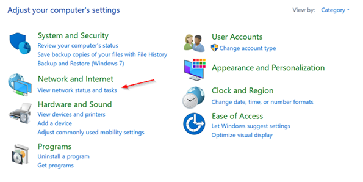
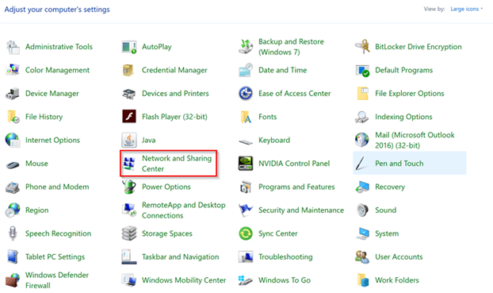
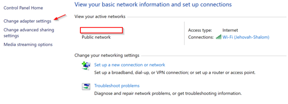
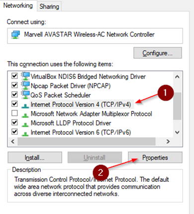
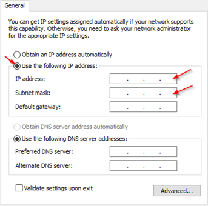
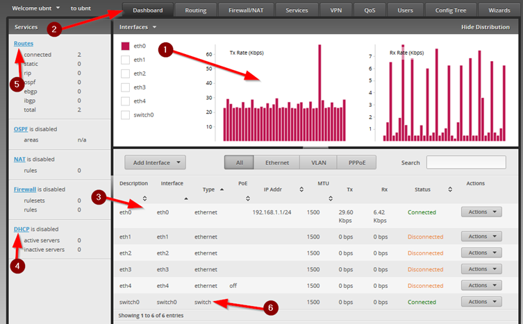
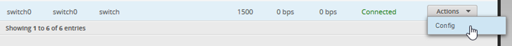
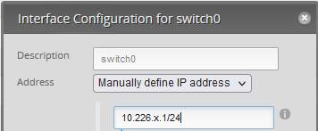
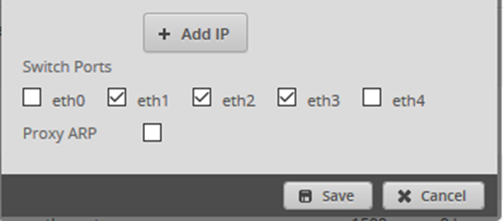

## Factory Reset the Router 

Reset the router to factory settings by doing the following:

1. Disconnect the Power Adapter from the router

2.    Press and hold the Reset button while connecting the Power Adapter to the router.

3.    Keep holding the button until the eth4 LED on the front of the router starts flashing and then stops flashing after a few seconds. The router has now been reset to factory settings.

## Layer 1 Setup 

1.    Unplug your computers’ network cables and use the caples you made to plug the computers into router ports from eth0, eth1 and eth2. These will be your ‘LAN’ connections.

3.    Plug one of the cables that was previously in the computer into eth4 of your router.  This will be your WAN connection.

# Router Configuration

## Temporary IP Setup

You will now use the computer connected to **eth0** on the router to login to the management interface of the router and configure it. By default, the router has a management IP address of 192.168.1.1/24 and is not running DHCP, which means you will need to statically configure your PC with an appropriate temporary IP address to communicate with the router. Use the IP address 192.168.1.2 and subnet mask of 255.255.255.0

To statically configure the computer’s IP address, do the following:

1.    Search for Control Panel using the Windows search bar.

2.    In the Control Panel, there could be two different views here. 

 For the view below, click ‘View Network status and tasks’ to proceed to the next step....

 .....and for the view below, click ‘Network and Sharing Center’ to proceed to the next step.

3.    In the Network and Sharing Center, click ‘Change Adapter Settings’
      

4.    Right-click on the Ethernet adapter in the next screen and click ‘Properties’. If there are multiple Ethernet adapters, choose the one that doesn’t say ‘Not connected’ or (it may also say ‘unknown network’).

5.    Scroll down to ‘Internet Protocol Version 4 (TCP/IPv4)’ and highlight it, then click ‘Properties’
      

6.    In the next screen, select ‘Use the Following IP Address’ to manually set the IP. This will enable the fields below. In these fields, enter the temporary IP address you chose in the step above and subnet mask for your network.
      

7.    Click OK to close out of all the windows. 

8.    Open a command prompt and use the IPConfig command to verify that your IP settings took effect. If not, reset the network adapter by right clicking on the network adapter and clicking ‘disable’ and then right clicking it again and clicking ‘enable’.

9.    From the same command prompt, issue the command `ping 192.168.1.1` and make sure you get a reply from the router before proceeding.

## Access the Management GUI

1.    Open a web browser on the same computer and browse to https://192.168.1.1 

2.    You will be presented with a warning screen, asking if you want to proceed. Depending on the browser you’re using the steps are different. 
 Firefox: Click ‘Advanced’, then ‘Accept the Risk and Continue’
 Chrome: Click ‘Advanced’, then ‘Proceed to 192.168.1.1 (unsafe)’

3.    Once past this warning, you will be presented with a login screen. At this prompt, enter these credentials
 **Username: ubnt
 Password: ubnt**

This will bring you to the main dashboard of the router. 

 

Notice the different areas of this dashboard:

1.    Traffic graphs showing the data flowing through the different ports of the router.

2.    Navigation tabs along the top to allow you to move to the different configuration areas.

3.    Details on the interfaces of the router. This also shows an IP addresses assigned to the interfaces, if available.

4.    DHCP Service information showing the status of the service

5.    Route information, telling the router where it should send packets.

6.    Switch functionality allowing some of the ports to function as switch ports instead of routed ports.

## Configure the LAN

Remember that routing and switching are functions, and many hardware devices today contain both functions. In order to setup our LAN, we need to convert ports 0 to 3 from router ports into switch ports.

1.    From the Dashboard, click on the ‘Actions’ dropdown to the right of the `switch0` line in the interface list near the bottom.
      
2.    We need to give our switch an IP address for our LAN clients to use as a default gateway. This IP address will be the router’s point of entry into the LAN.  Use `10.226.x.1` where `x` is your island's third octet and follow it with `/24` to specify the subnet mask.  This will be the default gateway for our LAN and the new management IP address of the router. 
      

2.    Check the 3 boxes at the bottom under ‘switch ports’ for eth1 through eth3.  We cannot add eth0 yet because it still has an IP address assigned to, which we are currently using to configure the router.
      

4.    Click Save when complete.

## Computer Connections

You now need to move our VMs on the same network as the switch.

On your VMs, modify the network settings and change it to the following:

- Attached to: `Bridged Adapter`
- Name: Accept the default

We will now make sure our other computers plugged into eth1 and eth2 receive a DHCP address from our DHCP server on the Domain Controller. Begin with the computer connected to eth2 and do the following:

1. On the host computer, open a command prompt and use the `ipconfig` command to see if the computer automatically obtained an IP address from your DHCP server in your network range.

   - If the computer still has a 169.254.x.x address, issue the following command to force it to contact DHCP for another address
      ipconfig /renew
2. Repeat this process for the computer plugged into eth1.
3.    When we configured the switch and set an IP on it, we created a new IP address that is not only the default gateway for the LAN, but we can use to manage the router from. In order to manage it from our LAN, we must use this new IP. 
      1.    On the computer connected to eth2, open a Web Browser and browse to the default gateway IP address `10.226.x.1`. 
4.    After clearing the certificate warning screen, make sure you can access the login screen.

## Eth0 Cleanup

Now that our LAN is functional, we can return to fix our eth0 port that is still using the temporary setup IP.

1.    From the computer connected to eth2, login to the Management GUI

2.    At the dashboard, in the interface list, click the ‘Actions’ drop-down on the line for eth0 and click ‘Config.

3.    In the ‘Address’ drop-down, choose ‘No address’ and click ‘Save’.

4.    In the interface list, click the ‘Actions’ drop-down on the line for switch0 and click ‘Config.

5.    Under ‘Switch Ports’, click the checkbox for ‘eth0’ and click ‘Save’.

6.    Return to the computer connected to eth0. Perform the steps 1-2 from the ‘Computer Connections’ section above to cause this computer to get a DHCP address in your group’s subnet.

## WAN Connections

We will now setup the WAN port to give our network a connection to the upstream network. The WAN port is basically what connects a network to a larger network elsewhere. Your home router’s Internet port is an example of a WAN port. Our WAN port is connected to the desk’s port, which then connects to the Instructor’s router. The Instructor’s router will then send your network’s packets out to the Internet.

1.    Click the ‘Dashboard’ tab to bring up the Dashboard, if it isn’t already.

2.    In the interface list, click the ‘Actions’ drop-down on the line for eth4 and click ‘Config.

3.    In the ‘Address’ drop-down, choose ‘Use DHCP’ and click ‘Save’.

4.    Eth4 will delay for a few seconds and then will return to the interface list, showing an IP address that was obtained via DHCP from the Instructor’s Router.

# Verification

## Ping Checks

1.    Open a command prompt on one of the PC’s and ping the other two PC’s to make sure you can ping them using the ping command `ping 10.226.x.1`
      - If you can’t ping them, check that they got an IP from DHCP and make sure you disabled the firewalls. 

2.    Next, ping the default gateway to make sure you can reach it. 

3.    Finally, ping Google’s DNS server `8.8.8.8` to make sure you have Internet connection

## Traceroute

Traceroute is a tool that can be used to check the different routers (hops) your packets travel through while moving toward a specified target. We will use it to check out path to Google’s DNS server. Use this command to perform a traceroute:

​    `tracert -d 8.8.8.8`

The `-d` tells traceroute to show numbers instead of the DNS names. The hops are shown like the example below:

`1  <1 ms  <1 ms  <1 ms 10.226.0.1`

The first column is the hop number. The lower the number, the closer that hop is to your source machine. The next 3 columns are 3 samples of the time it took to get to that hop, and the last column is the IP address of that hop.